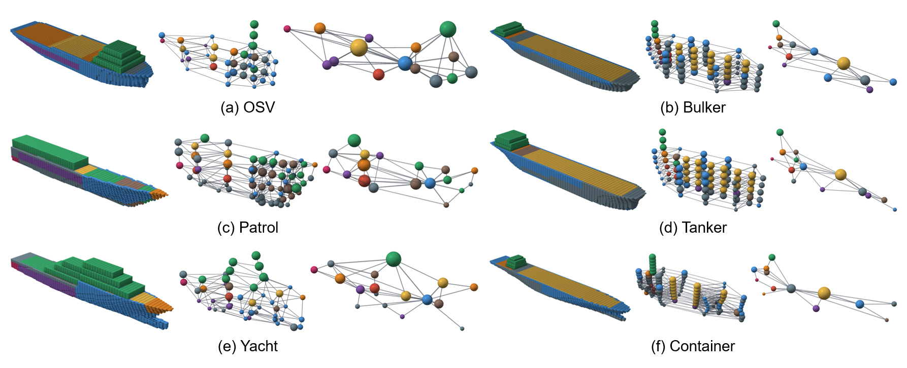

# ShipSpace-GA

[](https://doi.org/10.5281/zenodo.23196765)
[](LICENSE)

**Procedural generation of conceptual 3D ship internal arrangements for design-space exploration.**


<p align="center">
  
</p>

<p align="center">
  <a href="https://doi.org/10.5281/zenodo.23197299">
    
  </a>
</p>

<p align="center">
  <a href="docs/">Documentation</a> ·
  <a href="CITATION.cff">Citation</a>
</p>

**Version 1.0.** This repository generates 3D internal arrangements for six ship types (bulker, tanker, container(`CARGO` in code), offshore support vessel (OSV), patrol vessel, motor yacht) and compares them with 23 real general arrangements.

Each arrangement is stored as a voxel and graph representation. Every zone of the ship is a node labelled with its compartment (engine room, cargo, accommodation, fuel, ballast, ...), and touching zones are joined by edges.

The published synthetic corpus (49,998 arrangements, 8,333 per ship type, seed 42) is archived on **Zenodo** with this release. This repository holds the generator, the validation tools, the production hull masks and the 23 real general arrangements. Place the Zenodo corpus at `data/dataset_v1` to use the defaults below, or generate a fresh corpus with the same settings.

## Install

Python 3.10 or newer:

```bash
pip install -r requirements.txt
```

Tested with Python 3.13, NumPy 2.4, SciPy 1.17, PyTorch 2.11 and PyTorch Geometric 2.7.

## 1. Generate a dataset

```bash
python generate.py
```

By default this writes a new corpus to `data/dataset_v1` using the published settings: 8,333 arrangements per ship type, seed 42, 16 workers. A full run takes about 75 minutes with 16 parallel processes. The final merge holds the whole dataset in memory, which takes roughly 25 GB of RAM.

For a quick test (about 20 seconds):

```bash
python generate.py --out data/test_run --per-type 10 --workers 6
```

Options: `--out`, `--per-type`, `--seed`, `--workers` (number of random streams, which determines the samples) and `--processes` (how many workers run at once, which does not change the samples).

## 2. Validate against the real general arrangements

```bash
python validate.py
```

This compares a synthetic corpus (by default `data/dataset_v1`, from Zenodo or from `generate.py`) with the 23 real general arrangements in `data/real_ga` and writes `validation_output/`:

| Folder | Compared graphs |
|---|---|
| `stage5_conventional/` | every stored graph, as generated |
| `cc_aligned/` | 833 graphs per ship type (seed 44), re-extracted as connected regions of equal function, the same extraction as used for the real ships |

Each folder contains `similarity_metrics.json` / `.csv` (label JSD, KS tests, MMD, adjacency, centroids, coverage), per-family reports in `reports/`, and the figures `cmp1`–`cmp11` (PDF). `comparison_summary.json` sets the two side by side. The full dataset needs roughly 10 GB of RAM.

To validate another dataset, use `--dataset`, for example `python validate.py --dataset data/test_run --out validation_test --per-type 10`.

## Repository layout

```text
generate.py              generate a dataset
validate.py              compare a dataset with the real general arrangements
src/data_generator/      the generator
src/validation/          comparison with the real general arrangements
data/hull_cache/         17 voxelised hull forms (64 x 32 x 24 cells)
data/real_ga/            the 23 real general arrangements as graphs
```

The generator runs in six stages:

| Stage | Module | What it does |
|---|---|---|
| 1 | `ship_params.py` | samples the ship type, main dimensions and compartment volume budgets |
| 2 | `hull_mask.py`, `stl_mask_cache.py` | hull occupancy grid from the hull library |
| 3 | `bulkhead_placement.py`, `zone_connectivity.py` | bulkheads, decks and side zones divide the hull into zones |
| 4 | `compartment_assignment.py` | assigns a compartment to every zone (greedy fill, repair passes, LCG/KG optimisation) |
| 5 | `graph_builder.py`, `representation_converters.py` | zone graph and 64 x 32 x 32 voxel grids |
| 6 | `dataset_builder.py`, `companion.py`, `deck_codec.py` | quality checks, companions, train/val/test split, shard bundles |

`volume_metrics.py` and `validation_constants.py` hold the volume, LCG/KG/GM and label definitions shared by the generator and the validation.

The validation modules:

| Module | What it does |
|---|---|
| `zone_extraction.py` | connected-region zone extraction from a labelled voxel grid |
| `cc_reextract.py` | `cc_aligned` re-extraction and the validation runner |
| `similarity_metrics.py` | JSD, KS, MMD, adjacency, centroid and coverage metrics |
| `validation_report.py` | per-family reports |
| `compare_real_vs_synthetic.py`, `side_by_side_comparison.py` | figures `cmp1`–`cmp11` |

## Dataset format

```text
dataset_v1/
  meta.json                    settings and summary of the run
  train/  val/  test/          80 / 10 / 10 % split
    shard_000/
      original.pt              list of up to 500 graphs (PyTorch Geometric)
      companions/000000.npz    compact companion of graph 0, one file per graph
      records.json             one row per graph (identifiers, checks, companion hash)
      summary.json             shard summary
      COMMITTED.json           SHA-256 of every file in the shard
```

Loading a split:

```python
import sys
sys.path.insert(0, "src/data_generator")
from dataset_builder import load_split

graphs = load_split("data/dataset_v1", "train")
g = graphs[0]
```

Main fields of each graph:

- `x`: 19 geometric features per zone (centroid, size, hull fraction, deck, zone type).
- `y`: compartment class per zone.
- `edge_index`, `edge_attr`: zone adjacency. The 7 edge features are the centroid offset plus a one-hot of longitudinal, vertical, superstructure-hull or transverse.
- `cond`: 16 conditioning values (ship type, L/B/D, 7 volume budget fractions).
- `voxel_labels`: compartment class on a 64 x 32 x 32 grid.

Compartment classes:

| Class | Compartment |
|---|---|
| 0 | void |
| 1 | engine room |
| 2 | machinery |
| 3 | cargo |
| 4 | accommodation |
| 5 | fuel tanks |
| 6 | ballast tanks |
| 7 | steering gear |
| 8 | stores |
| 9 | navigation (not used) |
| 10 | outside the ship |

`load_split(..., with_companions=True)` also attaches the companion of each graph. Its arrays are described at the top of `src/data_generator/companion.py`.

## Documentation

Further detail is in `docs/`:

| Document | Contents |
|---|---|
| [`docs/GENERATOR.md`](docs/GENERATOR.md) | Stages, parameter ranges, taxonomy and eligibility |
| [`docs/DATASET.md`](docs/DATASET.md) | Corpus identity, graph/voxel schema and loading |
| [`docs/QC.md`](docs/QC.md) | Production acceptance checks vs diagnostic-only quantities |
| [`docs/PROVENANCE.md`](docs/PROVENANCE.md) | Hull-template sources and the 23 reconstructed real GAs |

## License

The code is MIT-licensed. The data in `data/` is licensed under CC BY 4.0. See `LICENSE`.

## Citation

See `CITATION.cff`.
